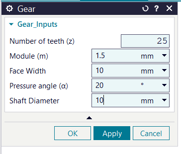
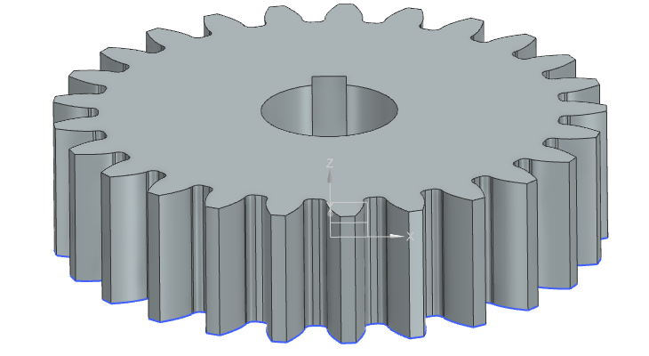
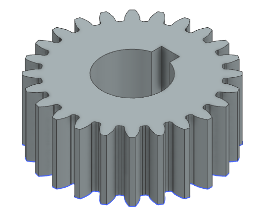
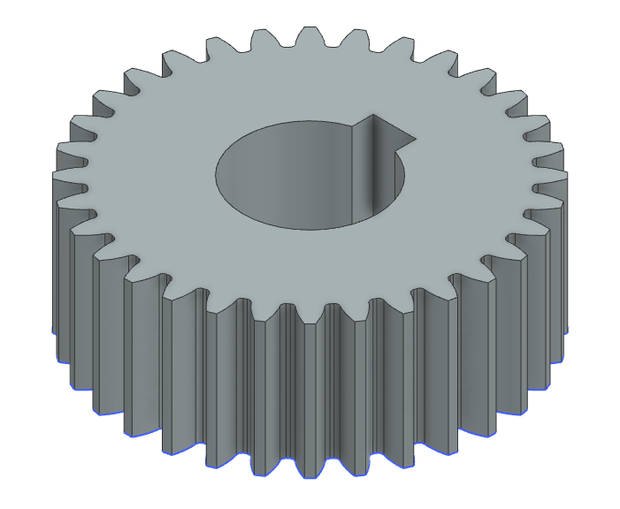
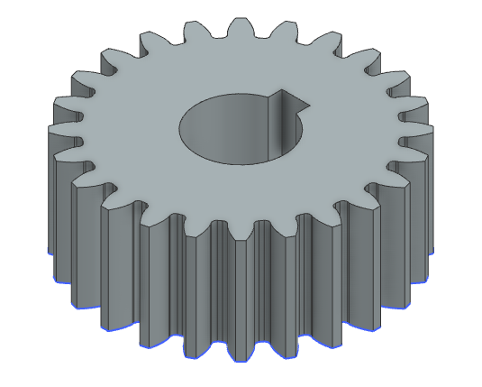

Spur Gear Generation Plugin for Siemens NX

A C# / NXOpen-based Siemens NX plugin for parametric spur gear generation.

📌 Project Overview

This project is a parametric spur gear generation plugin for Siemens NX, developed using C# and NXOpen.

The plugin allows the user to enter key gear parameters through an NX Block UI Styler dialog and automatically generates the corresponding 2D gear profile and 3D solid geometry inside the active NX part.

The project was developed to explore practical CAD automation, geometric computation, NXOpen API usage, parametric modeling, validation, and feature creation.

🎯 Project Objective

The objective is to automate a repetitive CAD modeling task:

User Input
    ↓
Block UI Styler
    ↓
GearParameters
    ↓
GearValidator
    ↓
SpurGearBuilder
    ↓
NXOpen Geometry
    ↓
3D Spur Gear

📸 Screenshots

Replace each placeholder with screenshots from Siemens NX.

1. Plugin UI

2. Generated Gear

3. Gear Profile / Involute Geometry

4. Parameterized Gear Examples

✨ Features

Parametric Spur Gear Generation

The plugin accepts:

Parameter

Description

Number of Teeth

Defines the number of gear teeth

Module

Defines the gear module

Face Width

Defines the extrusion width

Pressure Angle

Defines the involute pressure angle

Shaft Hole Diameter

Defines the central shaft opening

Pitch diameter, pitch radius, addendum radius, and dedendum radius are derived automatically from the primary inputs.

Involute Tooth Profile

The tooth flank is generated mathematically using an involute curve.

The base circle is calculated from:

Base Radius = Pitch Radius × cos(Pressure Angle)

The involute is sampled using calculated points and converted into NX spline geometry.

Root and Fillet Geometry

The plugin generates tooth-root connections, root arcs, fillet geometry, and tooth-to-tooth transitions.

Shaft Hole and Keyway

The plugin automatically creates a central shaft opening and keyway geometry based on the supplied shaft diameter.

The current implementation contains diameter-based keyway sizing logic with a fallback calculation for unsupported ranges.

This is a CAD automation project, not a complete standards-certified gear/keyway design system.

Input Validation

Before geometry generation, the plugin validates important parameters including:

Number of teeth

Module

Face width

Pressure angle

Undercutting condition

Shaft-hole/root clearance

NX Undo / Transaction Safety

An NX undo mark is created before generation. If an error occurs, the operation is rolled back to that mark so failed generation does not leave unwanted partial geometry.

Automatic 3D Feature Creation

The plugin:

Creates the sketch.

Generates the gear profile.

Updates the sketch.

Collects the profile curves.

Creates an NX section.

Creates an extrusion feature using the supplied face width.

🧠 Architecture

┌─────────────────────────────┐
│      Block UI Styler        │
│   Block_UI_for_Gear.cs      │
└──────────────┬──────────────┘
               ↓
┌─────────────────────────────┐
│       GearParameters        │
│    Input + Derived Data     │
└──────────────┬──────────────┘
               ↓
┌─────────────────────────────┐
│        GearValidator        │
│    Input / Design Checks    │
└──────────────┬──────────────┘
               ↓
┌─────────────────────────────┐
│       SpurGearBuilder       │
│   NX Geometry Generation    │
└──────────────┬──────────────┘
               ↓
┌─────────────────────────────┐
│          MathUtils          │
│ Mathematical / Geometric    │
│        Helper Methods       │
└──────────────┬──────────────┘
               ↓
┌─────────────────────────────┐
│         Siemens NX          │
│      NXOpen / NX Model      │
└─────────────────────────────┘

📂 Project Structure

Gear_generation_plugin/
│
├── Gear_generation_plugin.sln
│
├── Gear_generation_plugin/
│   ├── Block_UI_for_Gear.cs
│   ├── EntryPoint.cs
│   ├── GearParameters.cs
│   ├── GearValidator.cs
│   ├── MathUtils.cs
│   ├── NXSessionManager.cs
│   ├── SpurGearBuilder.cs
│   ├── Gear_Block_UI.dlx
│   │
│   └── Properties/
│       └── AssemblyInfo.cs
│
├── .gitignore
├── .gitattributes
└── README.md

🔧 Key Components

Block_UI_for_Gear.cs

Handles the Siemens NX Block UI Styler dialog, reads user inputs, creates GearParameters, invokes validation, starts generation, and handles errors.

GearParameters.cs

Acts as the central data model.

Primary inputs:

Teeth
Module
Face Width
Pressure Angle
Shaft Hole Diameter

Derived values:

Pitch Diameter
Pitch Radius
Addendum Radius
Dedendum Radius

The current formulas are:

Pitch Diameter = Module × Number of Teeth
Pitch Radius = Pitch Diameter / 2
Addendum Radius = Pitch Radius + Module
Dedendum Radius = Pitch Radius - 1.25 × Module

GearValidator.cs

Performs pre-generation checks such as input sanity, theoretical undercutting, and shaft-hole/root clearance.

SpurGearBuilder.cs

Main CAD generation engine responsible for:

Sketch creation

Base-circle calculation

Involute point generation

Left/right tooth flanks

Tooth rotation

Addendum arcs

Root fillets

Shaft/keyway profile

Extrusion

MathUtils.cs

Contains reusable mathematical and geometric helpers such as degree/radian conversion, point rotation, midpoint calculations, fillet calculations, and NX spline creation.

NXSessionManager.cs

Centralizes common NX session operations including work-part access, undo marks, rollback, and message handling.

EntryPoint.cs

Plugin entry point that launches the Block UI Styler dialog and disposes the UI object after use.

📐 Gear Geometry

The project uses parametric relationships between primary gear inputs and derived geometry.

Pitch Diameter

d = m × Z

Where:

d = pitch diameter

m = module

Z = number of teeth

Pitch Radius

r = d / 2

Addendum Radius

ra = r + m

Dedendum Radius

rf = r - 1.25m

Base Radius

rb = r × cos(α)

Where:

rb = base radius

r = pitch radius

α = pressure angle

🔄 Generation Workflow

1. User opens the plugin
          ↓
2. User enters gear parameters
          ↓
3. GearParameters object created
          ↓
4. GearValidator.Validate()
          ↓
5. NX undo mark created
          ↓
6. SpurGearBuilder.BuildGear()
          ↓
7. Sketch created
          ↓
8. Involute tooth flank generated
          ↓
9. Tooth replicated around gear
          ↓
10. Root and fillet geometry created
          ↓
11. Shaft/keyway profile created
          ↓
12. Sketch updated
          ↓
13. Curves collected into section
          ↓
14. Extrude feature created
          ↓
15. Generated spur gear remains in NX

🛡️ Error Handling

The plugin uses multiple layers of protection:

User Input
    ↓
Validation
    ↓
NX Undo Mark
    ↓
Geometry Generation
    ↓
Success → Keep Gear
    ↓
Failure → Undo to Mark
         ↓
      Show Error

This is particularly useful in CAD automation because a failed operation should not leave uncontrolled partial geometry in the active NX part.

💻 Technologies Used

Technology

Usage

C#

Main programming language

.NET Framework 4.8

Application framework

Siemens Designcenter NX

CAD platform

NXOpen

CAD automation API

NXOpen.BlockStyler

User interface

NXOpen.Features

Feature creation

NXOpen.Curves

Curve generation

NXOpen.Section

Profile/section creation

Visual Studio

Development environment

The current project targets .NET Framework 4.8 and references NXOpen assemblies from a Siemens Designcenter NX 2512 installation.

⚙️ Requirements

Siemens Designcenter NX

Visual Studio

.NET Framework 4.8

NXOpen managed libraries

Compatible Gear_Block_UI.dlx

The current project references NXOpen libraries from:

Siemens\DesigncenterNX2512\NXBIN\managed_core

If another NX version is used, update the NXOpen references accordingly.

🚀 How to Build

Clone the repository.

Open Gear_generation_plugin.sln.

Verify the NXOpen references point to your installed NX version.

Build the project in Visual Studio.

Ensure the generated .dll and required .dlx file are accessible to NX.

Launch the plugin from Siemens NX.

▶️ How to Use

Open Siemens NX.

Open or create a part.

Launch the Gear Generation plugin.

Enter:

Number of teeth

Module

Face width

Pressure angle

Shaft hole diameter

Click OK / Apply.

The inputs are validated.

If validation succeeds, the gear is generated.

If generation fails, the operation is rolled back and an error message is displayed.

🧪 Example Input

Teeth:               24
Module:              2.0 mm
Face Width:          20 mm
Pressure Angle:      20°
Shaft Hole Diameter: 20 mm

This example illustrates the input workflow; actual gear parameters should be selected according to the intended design requirements.

⚠️ Current Limitations

This project is a CAD automation and geometric modeling project, not a complete commercial gear-design package.

1. Involute / Root Transition

The current implementation generates the tooth flank using an involute curve and separately constructs the root region.

For certain combinations of tooth count and gear parameters, especially at higher tooth counts, the generated tooth/root transition can produce undesirable profile intersections.

This is primarily a gear-profile design/geometry limitation, rather than a limitation of the NX automation framework.

A future improvement would be a more complete tooth-root transition methodology with dedicated profile validation.

2. Gear Standards

The plugin does not implement a complete standards-based gear design system covering all ISO, DIN, or AGMA design requirements.

3. Manufacturing Validation

The generated model is not automatically validated for:

Manufacturing process

Gear strength

Contact stress

Bending stress

Backlash

Material selection

Detailed tolerance requirements

These should be evaluated separately for production use.

🔮 Future Improvements

More robust involute/root transition

Advanced tooth-profile validation

Additional gear standards

Helical gear generation

Internal gear generation

Gear-pair generation

Automatic parameter recommendations

Improved keyway standards support

Advanced geometry diagnostics

Drawing generation

Gear inspection automation

Automated CAD export

🧩 Engineering Approach

A major design goal was to separate the workflow into distinct responsibilities:

UI
 ↓
Data
 ↓
Validation
 ↓
Mathematics
 ↓
CAD Geometry
 ↓
NX Feature

This makes the project easier to maintain and provides a foundation for extending the plugin to other parametric CAD automation tasks.

📚 What This Project Demonstrates

Siemens NXOpen

C# CAD automation

Parametric CAD modeling

Mathematical geometry

Involute curve generation

NX sketch creation

NX spline and arc creation

NX feature creation

Block UI Styler

CAD input validation

Exception handling

NX undo/transaction handling

Separation of UI, validation, mathematics, and CAD-generation logic

👨‍💻 Author

Anand Barapatre

CAD Developer / CAD Automation

Areas of interest:

Siemens NX

NXOpen

C#

CAD Automation

Engineering Software

Parametric CAD

CAD Data Validation

📌 Project Status

Status: Completed portfolio prototype

The current version demonstrates the workflow from parameter input to automated 3D spur gear generation inside Siemens NX.

Further development can focus on advanced gear-profile geometry and additional CAD automation capabilities.

📄 License

This repository currently does not specify a separate open-source license.

If you intend to distribute or reuse the source code publicly, add an appropriate LICENSE file.

⭐ Connect

Feel free to explore the source code or connect with me regarding:

CAD Automation

Siemens NX / NXOpen

C# engineering applications

Parametric CAD development

CAD Developer opportunities